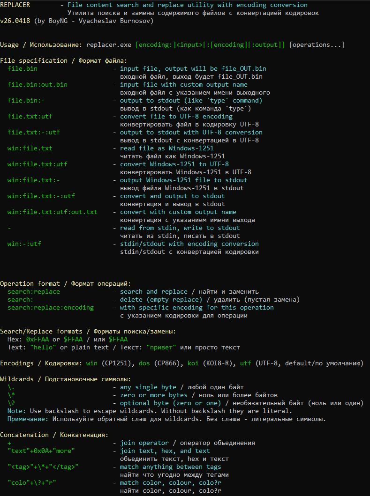

# REPLACER

**File content search and replace utility with encoding conversion**  
**Утилита поиска и замены содержимого файлов с конвертацией кодировок**

Version 26.0419 by BoyNG (Vyacheslav Burnosov)

---

## New in 26.0420 / Новое в версии 26.0420

**English:**
- **Single quote syntax**: Use single quotes `'...'` for literals inside double quotes for CMD
- **Simplified quoting**: `"'pattern':'replacement'"` instead of complex escaping
- **Capture entire match**: `\0` in replacement captures the entire matched pattern
- **Escape sequences in replacements**: `\n`, `\r`, `\t`, `\\` work in replacement strings
- **Quote-aware wildcards**: Wildcards inside quotes are literal, outside quotes are patterns
- **Multiple operations**: Pass each operation as separate argument

**Русский:**
- **Синтаксис с одинарными кавычками**: Используйте одинарные кавычки `'...'` для литералов внутри двойных для CMD
- **Упрощённые кавычки**: `"'паттерн':'замена'"` вместо сложного экранирования
- **Захват всего вхождения**: `\0` в замене захватывает весь найденный паттерн
- **Escape последовательности в заменах**: `\n`, `\r`, `\t`, `\\` работают в строках замены
- **Wildcards с учётом кавычек**: Wildcards внутри кавычек - литеральные, снаружи - паттерны
- **Множественные операции**: Передавайте каждую операцию как отдельный аргумент

## New in 26.0419 / Новое в версии 26.0419

**English:**
- **Escape sequences**: Support for `\n`, `\r`, `\t`, `\\`, `\"`, `\xHH` in text strings
- **Wildcards in text**: Use `\.`, `\*`, `\?` directly inside text without `+` concatenation
- **Flexible syntax**: Both `"test\.end"` and `"test"+\.+"end"` work
- **Hex escapes**: Use `\xHH` for hex bytes (e.g., `\x0A`, `\xFF`)

**Русский:**
- **Escape последовательности**: Поддержка `\n`, `\r`, `\t`, `\\`, `\"`, `\xHH` в текстовых строках
- **Wildcards в тексте**: Используйте `\.`, `\*`, `\?` прямо внутри текста без конкатенации `+`
- **Гибкий синтаксис**: Работают оба варианты `"test\.end"` и `"test"+\.+"end"`
- **Hex escape**: Используйте `\xHH` для hex байтов (например, `\x0A`, `\xFF`)

---

## New in 26.0418 / Новое в версии 26.0418

**English:**
- **Wildcard support**: Pattern matching with `\.` (any byte), `\*` (zero or more bytes), `\?` (optional byte)
- **Concatenation operator**: Join hex and text parts with `+` operator
- **Escape sequences**: Use backslash to enable wildcards, without backslash they are literal characters
- **Enhanced pattern matching**: Complex patterns like `"<tag>"+\*+"</tag>"` or `"colo"+\?+"r"`

**Русский:**
- **Поддержка wildcards**: Поиск по паттернам с `\.` (любой байт), `\*` (ноль или более байтов), `\?` (необязательный байт)
- **Оператор конкатенации**: Объединение hex и текста оператором `+`
- **Escape последовательности**: Используйте обратный слэш для wildcards, без слэша - литеральные символы
- **Расширенный поиск**: Сложные паттерны типа `"<tag>"+\*+"</tag>"` или `"colo"+\?+"r"`

---

## Description / Описание

**English:**  
REPLACER is a powerful command-line utility for Windows that performs binary and text search-and-replace operations on files with support for multiple character encodings. It can handle hex patterns, text strings, encoding conversions, and supports pipeline operations for chaining multiple replacements in a single pass.

**Русский:**  
REPLACER — мощная утилита командной строки для Windows, выполняющая операции поиска и замены в бинарных и текстовых файлах с поддержкой множества кодировок. Поддерживает hex-паттерны, текстовые строки, конвертацию кодировок и конвейерные операции для выполнения нескольких замен за один проход.

---

## Features / Возможности

**English:**
- Binary and text search and replace
- Multiple encoding support: UTF-8, Windows-1251 (CP1251), DOS (CP866), KOI8-R
- Hex input format: `0xFFAA` or `$FFAA`
- Text input format: quoted `"text"` or plain text
- Encoding conversion between different code pages
- Pipeline operations: chain multiple replacements
- Stdin/stdout support for use in pipes
- Custom output filenames
- Colorized help output

**Русский:**
- Бинарный и текстовый поиск и замена
- Поддержка множества кодировок: UTF-8, Windows-1251 (CP1251), DOS (CP866), KOI8-R
- Hex формат ввода: `0xFFAA` или `$FFAA`
- Текстовый формат: в кавычках `"текст"` или просто текст
- Конвертация между различными кодовыми страницами
- Конвейерные операции: цепочка нескольких замен
- Поддержка stdin/stdout для использования в конвейерах
- Пользовательские имена выходных файлов
- Цветная справка

---

## Usage / Использование

```
replacer [encoding:]<input>[:[encoding][:output]] [operations...]
```

### File Specification / Формат файла

| Syntax / Синтаксис | Description / Описание |
|---------------------|------------------------|
| `file.bin` | Input file, output will be `file_OUT.bin`<br>Входной файл, выход будет `file_OUT.bin` |
| `file.bin:out.bin` | Input file with custom output name<br>Входной файл с указанием имени выходного |
| `file.bin:-` | Output to stdout (like 'type' command)<br>Вывод в stdout (как команда 'type') |
| `file.txt:utf` | Convert file to UTF-8 encoding<br>Конвертировать файл в кодировку UTF-8 |
| `file.txt:-:utf` | Output to stdout with UTF-8 conversion<br>Вывод в stdout с конвертацией в UTF-8 |
| `win:file.txt` | Read file as Windows-1251<br>Читать файл как Windows-1251 |
| `win:file.txt:utf` | Convert Windows-1251 to UTF-8<br>Конвертировать Windows-1251 в UTF-8 |
| `win:file.txt:-` | Output Windows-1251 file to stdout<br>Вывод файла Windows-1251 в stdout |
| `win:file.txt:-:utf` | Convert and output to stdout<br>Конвертация и вывод в stdout |
| `win:file.txt:utf:out.txt` | Convert with custom output name<br>Конвертация с указанием имени выхода |
| `-` | Read from stdin, write to stdout<br>Читать из stdin, писать в stdout |
| `win:-:utf` | Stdin/stdout with encoding conversion<br>Stdin/stdout с конвертацией кодировки |

### Operation Format / Формат операций

| Syntax / Синтаксис | Description / Описание |
|---------------------|------------------------|
| `search:replace` | Search and replace<br>Найти и заменить |
| `search:` | Delete (empty replace)<br>Удалить (пустая замена) |
| `search:replace:encoding` | With specific encoding for this operation<br>С указанием кодировки для операции |

### Search/Replace Formats / Форматы поиска/замены

**Hex:**
- `0xFFAA` or `$FFAA`

**Text / Текст:**
- `"hello"` or plain text / `"привет"` или просто текст

### Encodings / Кодировки

| Code / Код | Description / Описание |
|------------|------------------------|
| `win` | Windows-1251 (CP1251) |
| `dos` | DOS (CP866) |
| `koi` | KOI8-R (CP20866) |
| `utf` | UTF-8 (default / по умолчанию) |

### Wildcards / Подстановочные символы

| Symbol / Символ | Description / Описание |
|-----------------|------------------------|
| `\.` | Any single byte / Любой один байт |
| `\*` | Zero or more bytes / Ноль или более байтов |
| `\?` | Optional byte (zero or one) / Необязательный байт (ноль или один) |

**Note / Примечание:** Use backslash to escape wildcards. Without backslash they are literal characters.  
Используйте обратный слэш для wildcards. Без слэша - это литеральные символы.

### Concatenation / Конкатенация

| Operator / Оператор | Description / Описание |
|---------------------|------------------------|
| `+` | Join operator to combine hex and text parts / Оператор объединения для комбинирования hex и текста |

**Examples / Примеры:**
- `"text"+0x0A+"more"` - join text, hex byte, and text / объединить текст, hex байт и текст
- `"<tag>"+\*+"</tag>"` - match anything between tags / найти что угодно между тегами
- `0xAA+\.+0xBB` - match 0xAA, any byte, then 0xBB / найти 0xAA, любой байт, затем 0xBB
- `"colo"+\?+"r"` - match color, colour, colo?r / найти color, colour, colo?r

### Important: Quoting Rules / Важно: Правила кавычек

**CRITICAL: New Syntax in 26.0420 / КРИТИЧНО: Новый синтаксис в 26.0420**

**For Windows CMD / Для Windows CMD:**
```cmd
REM Use double quotes outside, single quotes inside for literals
replacer.exe "file.txt":- "'pattern':'replacement'"

REM Wildcards work ONLY outside single quotes
replacer.exe "file.txt":- "'Version: '+*:'found'"

REM Wildcards inside single quotes are LITERAL
replacer.exe "file.txt":- "'file*.txt':'found'"

REM Multiple operations as separate arguments
replacer.exe "file.txt":- "'old':'new'" "'test':'demo'"

REM Capture entire match with \0
replacer.exe "file.txt":- "'error':'[\0]'"

REM Escape sequences in replacements
replacer.exe "file.txt":- "'line':'text\n'" "'tab':'\t\0\t'"
```

**English:**
- **Double quotes outside** `"..."` - required by CMD to group the argument
- **Single quotes inside** `'...'` - mark literal text (not wildcards)
- **Wildcards outside quotes** - `*`, `.`, `?` work as patterns
- **Wildcards inside quotes** - treated as literal characters
- **Spaces in replacements** - work naturally with this syntax
- **`\0` in replacement** - captures entire matched pattern
- **Escape sequences** - `\n`, `\r`, `\t`, `\\` work in replacements

**Русский:**
- **Двойные кавычки снаружи** `"..."` - требуются CMD для группировки аргумента
- **Одинарные кавычки внутри** `'...'` - обозначают литеральный текст (не wildcards)
- **Wildcards вне кавычек** - `*`, `.`, `?` работают как паттерны
- **Wildcards внутри кавычек** - обрабатываются как литеральные символы
- **Пробелы в заменах** - работают естественно с этим синтаксисом
- **`\0` в замене** - захватывает весь найденный паттерн
- **Escape последовательности** - `\n`, `\r`, `\t`, `\\` работают в заменах

**Why this syntax? / Почему такой синтаксис?**

Old syntax required complex escaping:
```cmd
REM OLD (complex, error-prone)
replacer.exe file.txt "\"Version: \"+\1+\".\"+\2:\"v\1.\2\""
```

New syntax is much simpler:
```cmd
REM NEW (simple, clear)
replacer.exe "file.txt":- "'Version: '+*+'.'+*:'v\1.\2'"
```

**For Git Bash (Unix shell on Windows) / Для Git Bash (Unix shell на Windows):**
```bash
# Still use single quotes to protect from bash
replacer file.txt 'pattern:replacement'
replacer file.txt "'pattern':'replacement'"
```
Use single quotes to protect the entire argument from bash processing.  
Используйте одинарные кавычки для защиты всего аргумента от обработки bash.

---

## Examples / Примеры

### 1. Basic hex replacement / Базовая hex замена

```bash
replacer file.bin 0xAA:0xBB
```
**English:** Replace all bytes `0xAA` with `0xBB` in `file.bin`, output to `file_OUT.bin`  
**Русский:** Заменить все байты `0xAA` на `0xBB` в `file.bin`, результат в `file_OUT.bin`

```bash
replacer file.bin $AA:$BB $CC:$DD
```
**English:** Multiple replacements: replace `0xAA` with `0xBB` AND `0xCC` with `0xDD` in one pass  
**Русский:** Множественные замены: заменить `0xAA` на `0xBB` И `0xCC` на `0xDD` за один проход

### 2. Custom output filename / Пользовательское имя выходного файла

```bash
replacer file.bin:output.bin 0xAA:0xBB
```
**English:** Replace bytes and save result to `output.bin` instead of default `file_OUT.bin`  
**Русский:** Заменить байты и сохранить результат в `output.bin` вместо `file_OUT.bin` по умолчанию

### 3. Text replacement / Текстовая замена

```bash
replacer file.txt "hello":"world"
```
**English:** Replace text "hello" with "world" in `file.txt`, output to `file_OUT.txt`  
**Русский:** Заменить текст "hello" на "world" в `file.txt`, результат в `file_OUT.txt`

```bash
replacer file.txt hello:world
```
**English:** Same as above but without quotes (plain text format)  
**Русский:** То же самое, но без кавычек (формат простого текста)

```bash
replacer file.txt "old text":"new text" "foo":"bar"
```
**English:** Multiple text replacements in one pass  
**Русский:** Множественные текстовые замены за один проход

### 4. Delete operation / Операция удаления

```bash
replacer file.txt "hello":
```
**English:** Delete all occurrences of "hello" (replace with empty string)  
**Русский:** Удалить все вхождения "hello" (заменить на пустую строку)

```bash
replacer file.bin 0xAA:
```
**English:** Delete all bytes `0xAA` from binary file  
**Русский:** Удалить все байты `0xAA` из бинарного файла

### 5. Encoding conversion / Конвертация кодировок

```bash
replacer win:file.txt:utf
```
**English:** Convert file from Windows-1251 to UTF-8, save as `file_OUT.txt`  
**Русский:** Конвертировать файл из Windows-1251 в UTF-8, сохранить как `file_OUT.txt`

```bash
replacer dos:file.txt:win:output.txt
```
**English:** Convert from DOS (CP866) to Windows-1251, save as `output.txt`  
**Русский:** Конвертировать из DOS (CP866) в Windows-1251, сохранить как `output.txt`

```bash
replacer koi:file.txt:utf
```
**English:** Convert from KOI8-R to UTF-8  
**Русский:** Конвертировать из KOI8-R в UTF-8

### 6. Text replacement with specific encoding / Текстовая замена с указанием кодировки

```bash
replacer win:file.txt:utf "тест":"test"
```
**English:** Read file as Windows-1251, replace Russian "тест" with "test", output as UTF-8  
**Русский:** Читать файл как Windows-1251, заменить русское "тест" на "test", вывод в UTF-8

```bash
replacer file.txt "привет":"hello":win
```
**English:** Replace text using Windows-1251 encoding for this specific operation  
**Русский:** Заменить текст используя кодировку Windows-1251 для этой конкретной операции

```bash
replacer dos:file.txt "текст":"text":dos "hello":"мир":dos
```
**English:** Read DOS file, perform multiple replacements with DOS encoding  
**Русский:** Читать DOS файл, выполнить множественные замены с кодировкой DOS

### 7. Output to stdout / Вывод в stdout

```bash
replacer file.txt:-
```
**English:** Output file content to stdout (like `type` command), no modifications  
**Русский:** Вывести содержимое файла в stdout (как команда `type`), без изменений

```bash
replacer file.txt:- 0xAA:0xBB
```
**English:** Replace bytes and output result to stdout instead of file  
**Русский:** Заменить байты и вывести результат в stdout вместо файла

```bash
replacer win:file.txt:-:utf
```
**English:** Read Windows-1251 file, convert to UTF-8, output to stdout  
**Русский:** Читать файл Windows-1251, конвертировать в UTF-8, вывести в stdout

```bash
replacer file.txt:-:dos "hello":"мир"
```
**English:** Replace text and output to stdout in DOS encoding  
**Русский:** Заменить текст и вывести в stdout в кодировке DOS

### 8. Pipeline operations / Конвейерные операции

```bash
replacer file.txt "old":"new" "foo":"bar" "test":
```
**English:** Chain multiple operations: replace "old" with "new", "foo" with "bar", delete "test"  
**Русский:** Цепочка операций: заменить "old" на "new", "foo" на "bar", удалить "test"

```bash
replacer file.bin 0xAA:0xBB 0xBB:0xCC 0xCC:0xDD
```
**English:** Sequential hex replacements (note: operations are applied in order)  
**Русский:** Последовательные hex замены (внимание: операции применяются по порядку)

```bash
replacer win:file.txt:utf "тест":"test":win "hello":"привет":utf
```
**English:** Mixed encoding operations: first operation uses Windows-1251, second uses UTF-8  
**Русский:** Смешанные операции с кодировками: первая использует Windows-1251, вторая UTF-8

### 9. Wildcard patterns / Паттерны с wildcards

**NEW SYNTAX (26.0420):**

```cmd
replacer.exe "test.html":- "'<title>'+*+'</title>':'<title>New</title>'"
```
**English:** Match anything between tags using `*` wildcard (outside quotes)  
**Русский:** Найти что угодно между тегами используя wildcard `*` (вне кавычек)

```cmd
replacer.exe "test.bin":- "0xAA+.+0xBB:0xFF"
```
**English:** Match 0xAA, any single byte (`.`), then 0xBB, replace with 0xFF  
**Русский:** Найти 0xAA, любой один байт (`.`), затем 0xBB, заменить на 0xFF

```cmd
replacer.exe "test.txt":- "'colo'+?+'r':'COLOR'"
```
**English:** Match "color" or "colour" using optional byte wildcard `?`  
**Русский:** Найти "color" или "colour" используя wildcard необязательного байта `?`

```cmd
replacer.exe "test.txt":- "'file*.txt':'found'"
```
**English:** Match literal `file*.txt` (wildcards inside quotes are literal)  
**Русский:** Найти литеральный `file*.txt` (wildcards внутри кавычек - литеральные)

```cmd
replacer.exe "test.txt":- "'file'+*+'.txt':'found'"
```
**English:** Match `file` + any chars + `.txt` (wildcards outside quotes are patterns)  
**Русский:** Найти `file` + любые символы + `.txt` (wildcards вне кавычек - паттерны)

```bash
replacer test.txt "test"+0x0D0A:"replaced"+0x0A
```
**English:** Concatenate text and hex: match "test" + CRLF, replace with "replaced" + LF  
**Русский:** Конкатенация текста и hex: найти "test" + CRLF, заменить на "replaced" + LF

```bash
replacer file.bin 0xFF+\*+0x00:0xAA
```
**English:** Match 0xFF followed by any bytes followed by 0x00, replace entire match with 0xAA  
**Русский:** Найти 0xFF за которым следуют любые байты и затем 0x00, заменить всё совпадение на 0xAA

```bash
replacer log.txt "ERROR"+\*+0x0A:
```
**English:** Delete entire lines starting with "ERROR" (match ERROR + any chars + newline, replace with empty)  
**Русский:** Удалить целые строки начинающиеся с "ERROR" (найти ERROR + любые символы + перевод строки, заменить на пустоту)

```bash
replacer data.txt "["+"\""+\*+"\""+"]":"[REDACTED]"
```
**English:** Match and replace JSON-like strings in brackets: `["anything"]` → `[REDACTED]`  
**Русский:** Найти и заменить JSON-подобные строки в скобках: `["что угодно"]` → `[REDACTED]`

```bash
replacer config.ini "password"+\*+0x0D0A:"password=***"+0x0D0A
```
**English:** Redact passwords in INI files: match "password" + any chars + CRLF, replace with masked value  
**Русский:** Скрыть пароли в INI файлах: найти "password" + любые символы + CRLF, заменить на замаскированное значение

```bash
replacer source.c "//"+\*+0x0A:0x0A
```
**English:** Remove C++ style comments: match "//" + any chars + newline, replace with just newline  
**Русский:** Удалить C++ комментарии: найти "//" + любые символы + перевод строки, заменить на просто перевод строки

```bash
replacer file.txt "test"+\.+\.+\.+"end":"MATCH"
```
**English:** Match "test" followed by exactly 3 bytes, then "end"  
**Русский:** Найти "test" за которым следуют ровно 3 байта, затем "end"

```bash
replacer data.bin 0xAA+\?+0xBB+\?+0xCC:0xFF
```
**English:** Match hex patterns with optional bytes: 0xAA [optional] 0xBB [optional] 0xCC  
**Русский:** Найти hex паттерны с необязательными байтами: 0xAA [необязательный] 0xBB [необязательный] 0xCC

```bash
replacer html.txt "<"+\*+">":
```
**English:** Remove all HTML tags (match < + any chars + >, replace with empty)  
**Русский:** Удалить все HTML теги (найти < + любые символы + >, заменить на пустоту)

### 10. Capture and escape sequences / Захват и escape последовательности

**NEW SYNTAX (26.0420):**

```cmd
replacer.exe "file.txt":- "'error':'[\0]'"
```
**English:** Capture entire match with `\0` - outputs `[error]`  
**Русский:** Захватить всё вхождение с `\0` - выведет `[error]`

```cmd
replacer.exe "file.txt":- "'word':'\0 and \0'"
```
**English:** Duplicate matched text - outputs `word and word`  
**Русский:** Дублировать найденный текст - выведет `word and word`

```cmd
replacer.exe "file.txt":- "'Version: '+*:'Found: \0'"
```
**English:** Capture wildcard match - `Version: 1.2` becomes `Found: Version: 1.2`  
**Русский:** Захватить wildcard совпадение - `Version: 1.2` станет `Found: Version: 1.2`

```cmd
replacer.exe "file.txt":- "'line':'text\n'"
```
**English:** Add newline using `\n` escape sequence in replacement  
**Русский:** Добавить перевод строки используя escape последовательность `\n` в замене

```cmd
replacer.exe "file.txt":- "'text':'\t\0\t'"
```
**English:** Wrap match in tabs using `\t` escape  
**Русский:** Обернуть совпадение в табуляции используя `\t` escape

```cmd
replacer.exe "file.txt":- "'colo\*\x72':'change color'"
```
**English:** Hex escape `\xHH` in search pattern  
**Русский:** Hex escape `\xHH` в паттерне поиска

```cmd
replacer.exe "file.txt":- "'path':'C:\\new'"
```
**English:** Backslash escape `\\` in replacement  
**Русский:** Escape обратного слэша `\\` в замене

**Supported escape sequences in replacements / Поддерживаемые escape последовательности в заменах:**
- `\0` → entire matched pattern / весь найденный паттерн
- `\n` → newline (0x0A)
- `\r` → carriage return (0x0D)
- `\t` → tab (0x09)
- `\\` → backslash (0x5C)
- `\xHH` → hex byte (e.g., `\x0A`, `\xFF`)

**Wildcards (outside quotes only) / Wildcards (только вне кавычек):**
- `*` → zero or more bytes / ноль или более байтов
- `.` → any single byte / любой один байт
- `?` → optional byte / необязательный байт

### 11. Stdin/stdout mode / Режим stdin/stdout

```bash
replacer - 0xAA:0xBB < input.bin > output.bin
```
**English:** Read from stdin, replace bytes, write to stdout (full pipeline mode)  
**Русский:** Читать из stdin, заменить байты, записать в stdout (полный конвейерный режим)

```bash
type input.bin | replacer - 0xAA:0xBB > output.bin
```
**English:** Use with Windows `type` command in pipeline  
**Русский:** Использование с командой Windows `type` в конвейере

```bash
type file.txt | replacer - "old":"new"
```
**English:** Text replacement in pipeline  
**Русский:** Текстовая замена в конвейере

```bash
replacer - "old":"new" < file.txt
```
**English:** Read from redirected stdin, output to console  
**Русский:** Читать из перенаправленного stdin, вывод в консоль

```bash
replacer - "old":"new" < file.txt 2>nul
```
**English:** Same as above but suppress error messages (redirect stderr to nul)  
**Русский:** То же самое, но подавить сообщения об ошибках (перенаправить stderr в nul)

```bash
replacer win:-:utf < input.txt > output.txt
```
**English:** Convert Windows-1251 stdin to UTF-8 stdout using redirection  
**Русский:** Конвертировать Windows-1251 из stdin в UTF-8 в stdout используя перенаправление

```bash
replacer dos:-:utf < dos_file.txt > utf_file.txt
```
**English:** Convert DOS (CP866) file to UTF-8 using stdin/stdout  
**Русский:** Конвертировать DOS (CP866) файл в UTF-8 используя stdin/stdout

### 12. Mixed operations / Смешанные операции

```bash
replacer file.bin:result.bin 0xFF: "test":"demo" $AA:$BB
```
**English:** Delete all `0xFF` bytes, replace text "test" with "demo", replace `0xAA` with `0xBB`  
**Русский:** Удалить все байты `0xFF`, заменить текст "test" на "demo", заменить `0xAA` на `0xBB`

```bash
replacer win:file.txt:utf:output.txt "старый":"новый":win "test":"тест":utf
```
**English:** Convert file encoding and perform replacements with different encodings per operation  
**Русский:** Конвертировать кодировку файла и выполнить замены с разными кодировками для каждой операции

```bash
replacer file.txt:- 0x0D0A:0x0A
```
**English:** Convert Windows line endings (CRLF) to Unix (LF) and output to stdout  
**Русский:** Конвертировать Windows окончания строк (CRLF) в Unix (LF) и вывести в stdout

### 13. Practical use cases / Практические примеры использования

```bash
replacer config.ini "localhost":"192.168.1.100"
```
**English:** Update server address in configuration file  
**Русский:** Обновить адрес сервера в конфигурационном файле

```bash
replacer dos:autoexec.bat:win "C:\\OLD":"C:\\NEW":dos
```
**English:** Update paths in DOS batch file, convert to Windows encoding  
**Русский:** Обновить пути в DOS batch файле, конвертировать в Windows кодировку

```bash
replacer firmware.bin 0x00FF00FF:0xFF00FF00
```
**English:** Patch binary firmware file  
**Русский:** Пропатчить бинарный файл прошивки

```bash
type template.html | replacer - "{{NAME}}":"John" "{{DATE}}":"2026-04-17" > output.html
```
**English:** Simple template engine using stdin/stdout  
**Русский:** Простой шаблонизатор используя stdin/stdout

```bash
replacer win:legacy.txt:utf "©":"(c)":win "®":"(R)":win
```
**English:** Replace special characters in legacy Windows-1251 file, output as UTF-8  
**Русский:** Заменить специальные символы в старом файле Windows-1251, вывод в UTF-8

```bash
replacer access.log "IP: "+\*+" -":"IP: [REDACTED] -"
```
**English:** Anonymize IP addresses in log files using wildcard pattern  
**Русский:** Анонимизировать IP адреса в лог файлах используя wildcard паттерн

```bash
replacer source.cpp "TODO"+\*+0x0A:"DONE"+0x0A
```
**English:** Mark all TODO comments as DONE in source code  
**Русский:** Пометить все TODO комментарии как DONE в исходном коде

```bash
replacer data.csv ","+\*+",":","
```
**English:** Remove content between commas in CSV (clean empty fields)  
**Русский:** Удалить содержимое между запятыми в CSV (очистить пустые поля)

```bash
replacer email.txt "password"+\?+":"+\*+0x0A:"password: [HIDDEN]"+0x0A
```
**English:** Redact passwords from email dumps (handles "password:" and "passwords:")  
**Русский:** Скрыть пароли из дампов email (обрабатывает "password:" и "passwords:")

```bash
replacer binary.dat 0xDEADBEEF+\.+\.+\.+\.:0xCAFEBABE+0x00000000
```
**English:** Patch binary signature: find 0xDEADBEEF + 4 bytes, replace with 0xCAFEBABE + 4 zeros  
**Русский:** Пропатчить бинарную сигнатуру: найти 0xDEADBEEF + 4 байта, заменить на 0xCAFEBABE + 4 нуля

```bash
replacer script.bat "REM"+\*+0x0D0A:0x0D0A
```
**English:** Remove all REM comments from batch file (keep line breaks)  
**Русский:** Удалить все REM комментарии из batch файла (сохранить переводы строк)

```bash
replacer json.txt "\"token\""+\?+":"+\?+"\""+\*+"\"":"\"token\": \"***\""
```
**English:** Redact JSON tokens with flexible spacing: `"token":"value"` or `"token" : "value"`  
**Русский:** Скрыть JSON токены с гибкими пробелами: `"token":"value"` или `"token" : "value"`

---

### CLI help information / Вывод помощи в консоли



---

## Building / Сборка

**English:**  
Compile with any C compiler for Windows (MSVC, MinGW, etc.):

```bash
gcc -o replacer.exe replacer.c
cl replacer.c
```

**Русский:**  
Компилируйте любым C компилятором для Windows (MSVC, MinGW и т.д.):

```bash
gcc -o replacer.exe replacer.c
cl replacer.c
```

---

## Requirements / Требования

- Windows OS
- Windows API support
- ANSI color support (Windows 10+ with virtual terminal processing)

---

## License / Лицензия

**English:**  
Free to use and modify.

**Русский:**  
Свободно для использования и модификации.

---

## Author / Автор

**BoyNG (Vyacheslav Burnosov)**

Version / Версия: 26.0420
